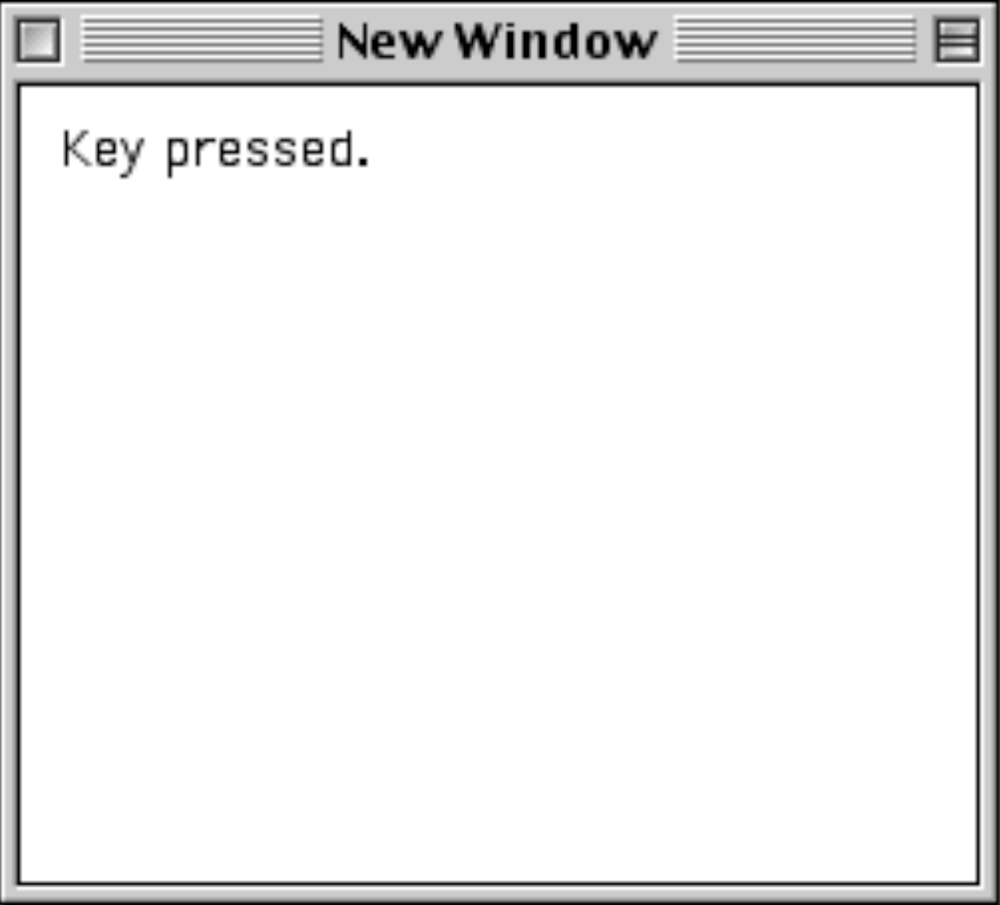

#Macintosh Toolbox C Boilerplate

## What is a Macintosh Toolbox?
Yeah, it's what we all coded against in the 90's on the Macintosh. Well, except me. I was still watching Teenage Mutant Ninja Turtles and eating breakfast cereal, so I didn't have the capacity to be developing for such systems at the time. But, I'm doing it now!

**Macintosh Toolbox** refers to a set of API's available to C, C++ and Pascal developers, in order to ensure their applications ran as expected on a Macintosh 68k through to the PowerPC. Later revisions of the macOS utilized a Cocoa layer which replaced Macintosh Toolbox.

## What's this code?
This code is an example of the boilerplate code required to bootstrap even the most basic of programs for the Macintosh. Discussion to follow.

## What does this do?
Right now, not much:

- We start up the app, initialize, and enter an event loop.
- On receiving certain events, we handle them.

## How to use it?
This code requires Metrowerks CodeWarrior 7.1+ to run; open the `MacBoilerplate.µ` project file. If you're using a different version of Metrowerks, you may need to just junk the project file, create a new project, and include the `.c` and `.rsrc` files.

## TODO
Some things I'm going to be adding (because it's not actually complete, yet, and I don't know how ot do these things):

- Menus
- Controls
- File System access
- Alerts
- Buttons and Button handlers
- Keyboard Shortcuts
- Network access

## Who to blame
Yeah, I'm sorry. (c) 2019 James Robert Perih <<james@hotdang.ca>>